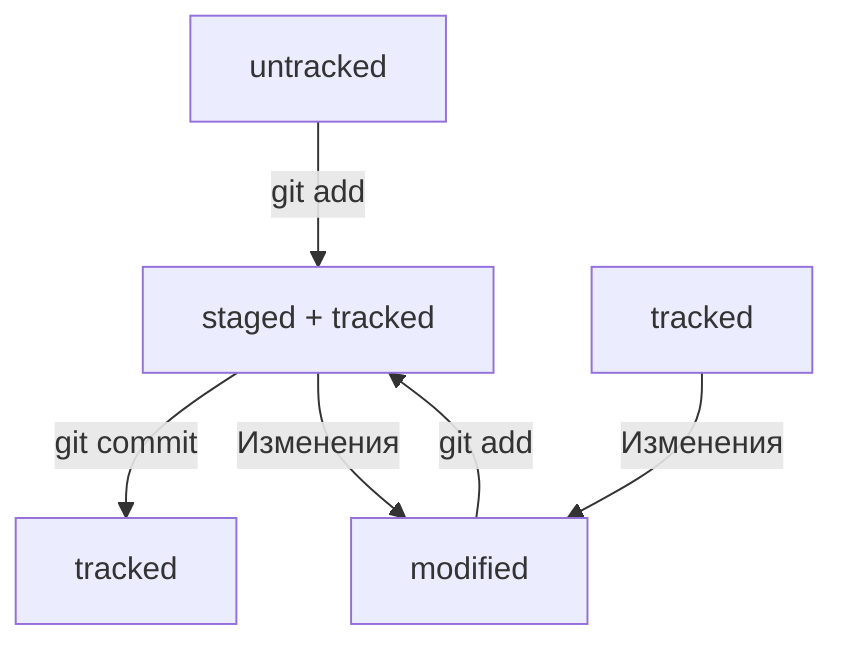

# Практическая работа №1. «Делимся проектом с миром»

Автор *Грошев Алексей Алексеевич*

## Инструкции по инициализации проекта.

1. [Что такое Git](https://git-scm.com/book/en/v2)
2. [Знакомство с GitHub](https://docs.github.com/ru)
3. [Как создать и оформить README](https://gist.github.com/fomvasss/8dd8cd7f88c67a4e3727f9d39224a84c)

## Файл HEAD

* В числе прочих файлов в папке .git есть служебный файл HEAD. Он указывает на самый свежий коммит.
* Вместо хеша последнего коммита можно написать слово HEAD — Git вас поймёт.

# Схема изменения статусов файлов в Git.

